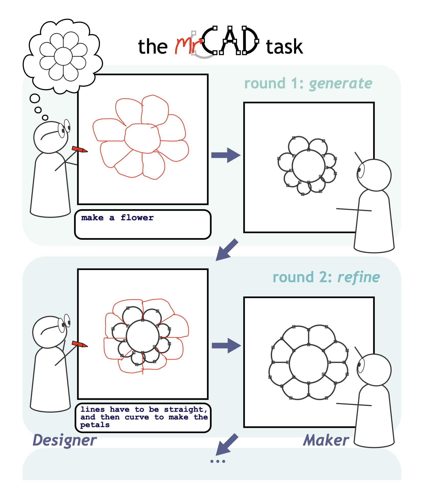
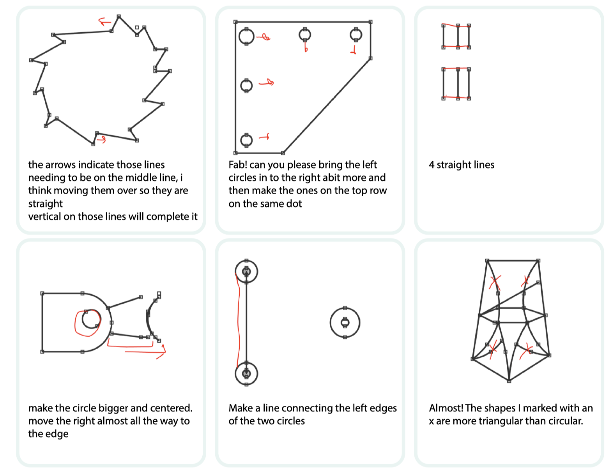

# mrCAD
## Multimodal Refinement of Computer-Aided Design

Welcome to the mrCAD project page.

The mrCAD project consists of:
- A [paper](https://arxiv.org/abs/2504.20294).
- A [dataset](data/mrcad_dataset.csv.zip) of multimodal refinement instructions of 2D Computer-Aided Designs (CADs).
- An [environment]() to benchmark your models on our baseline.
- Preliminary [analyses]() of the dataset.

## The mrCAD Dataset

Download the dataset [here](data/mrcad_dataset.csv.zip).

<div style="text-align: center;">
  
</div>


The mrCAD dataset was collected by pairing participants in an online communication game.
Over multiple rounds, two players, the *Designer* and the *Maker*, worked together to recreated target designs.
The *Designer* was shown a target design and sent instructions to the *Maker*.
The *Maker* couldn't see the target, so followed the instructions to creating and edit their CAD to match the target.

The mrCAD dataset consists of:
- **15,163 instructions and corresponding executions**,
- across **6,082 unique communication games**,
- performed by **1,092 pairs of participants**,
- and includes **3,166 unique CADs**.

## Dataset partitions

We partition our dataset into three distinct subsets:
- **coverage set**, containing 2249 unique CADs each successfully reconstructed by 1−2 dyads;
- **dense set**, containing 698 unique CADs each successfully reconstructed by at 3−6 dyads;
- **very-dense** set, containing 27 unique CADs successfully reconstructed by at least 30 dyads.


### Instructions

Instructions could include drawing, text, or a combination of both.
The primary data collection goal was to collect examples of *multimodal refinement instructions*, that is, instructions for editing and existing CAD (i.e. round number > 1) that included both text and drawing.

<div style="text-align: center;">
  
</div>


These include a range of linguistic phenomena such as reference and grounding, as well as extra-linguistic phenomena such as arrows, depiction, and dimensions.

# mrCAD environment

## Setup

```
conda create -n mrcad-env python=3.11
pip install git+https://github.com/AutodeskAILab/mrCAD.git
```

To run training or evaluation experiments, you would need additional dependencies installed.
```
pip install -r requirements.txt
```

## Loading the mrCAD dataset
Once you have installed the `mrcad` package, you can load the dataset using [HuggingFace Datasets](https://github.com/huggingface/datasets/).

> [!IMPORTANT]
> Make sure to install the `mrcad` package _before_ trying to load the dataset since the dataset loader uses the `mrcad` package to prepare the data.

```python
from datasets import load_dataset

mrcad_dataset = load_dataset("mrcad-project/mrcad", trust_remote_code=True)
```

> [!NOTE]
> You need to pass the `trust_remote_code=True` argument since the dataset loading script executes code from the `mrcad` package to process data.

## The format of a trial

The dataset is presented as a set of trials. Each trial includes:
- `trial_id`: string identifier for the trial
- `target_id`: string identifier for the target design
- `dyad_id`: string identified for the dyad completing this trial
- `trial_num`: index of the trial in the sequence of trials completed by the dyad
- `target`: JSON dump of a `Design` object that is the target to be reconstructed
- `rounds`: List of rounds in the trial
  - `round_num`: integer index of the round
  - `context`: JSON dump of a `Design` object that is the state of the design at the beginning of the round
  - `instruction`: instruction produced by the _Designer_
    - `text`: string of the text component of the instruction
    - `drawing`: array structure of coordinates used to represent drawing strokes
  - `execution`: _Maker_'s response
    - `design`: JSON dump of a `Design` object that the _Maker_ produces
  - `edit_execution`: actions taken by the _Maker_
    - `edits`: list of editing actions
    - `design`: JSON dump of a `Design` object obtained by executing the actions on the `context` design.

> [!NOTE]
> Due to minor errors with some extraneous actions recorded during data collection, there may be minor discrepancies between the `design` in the `execution` field and that in the `edit_execution` field. The one associated with the `execution` field is the actual output produced by participants, while the one in the `edit_execution` field is what is obtained by executing the recorded editing actions.

To load each of these objects, you can use the tools provided in this module.

```python
from mrcad import Design, Instruction, Execution
from mrcad.editing_actions import EditExecution

# Split used for evaluating models. You can find other splits by inspecting the dataset.
SPLIT = "eval_verified_complete"

# Example element
IDX = 0

trial = mrcad_dataset[SPLIT][IDX]
target = Design.model_validate(trial["target"])
rounds = [
    {
        "context": Design.model_validate(r["context"]),
        "instruction": Instruction.model_validate(r["instruction"]),
        "execution": Execution.model_validate(r["execution"]),
        "edit_execution": EditExecution.model_validate(r["edit_execution"]),
    }
    for r in trial["rounds"]
]
```

## Evaluating vision-language models

For experiments in the paper, we used [OpenRouter](https://openrouter.ai/) to make calls to LLM APIs so we have a unified interface with a number of LLM API providers.

```
python -m fire experiments/run_maker_evaluation.py main openrouter https://openrouter.ai/api/v1 <API_KEY> <MODEL_NAME> actions <SAVE_PATH>
```

The pipeline also supports querying models running on a vLLM server (for example, one being served at `http://localhost:$PORT/v1`).

```
python -m fire experiments/run_maker_evaluation.py main openrouter http://localhost:$PORT/v1 "dummy" <MODEL_NAME> actions <SAVE_PATH>
```

For Qwen2.5 models we evaluated, we used a different prompt that includes the tool descriptions. 

```
python -m fire experiments/run_maker_evaluation.py main qwen-vllm http://localhost:$PORT/v1 "dummy" <MODEL_NAME> actions <SAVE_PATH>
```

## Training
For training, we used the following command to run it with [HuggingFace Accelerate](https://github.com/huggingface/accelerate/) and [DeepSpeed](https://github.com/deepspeedai/DeepSpeed).

Before running training, you can run `accelerate config --config_file <DEEPSPEED_CONFIG_FILE>` to set up the configuration based on your compute environment.

```
accelerate launch --main_process_port $PORT --config_file <DEEPSPEED_CONFIG_FILE> agents/training/train.py experiments/qwen_training_configs/actions_all.yaml
```

## Cite
```
@misc{mccarthy2025mrcadmultimodalrefinementcomputeraided,
  title     = {mrCAD: Multimodal Refinement of Computer-aided Designs},
  author    = {William P. McCarthy and Saujas Vaduguru and Karl D. D. Willis and Justin Matejka and Judith E. Fan and Daniel Fried and Yewen Pu},
  year      = {2025},
  eprint    = {2504.20294},
  archivePrefix = {arXiv},
  primaryClass  = {cs.AI},
  url       = {https://arxiv.org/abs/2504.20294}
}
```